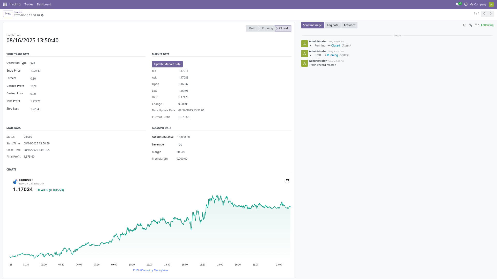

# Rusetta Trade – Odoo Trading Module

**Rusetta Trade** is an **Odoo module** designed for traders who want to track and manage forex-style trades directly inside Odoo.
It provides simple yet powerful tools for **entry tracking, stop-loss/take-profit management, profit calculation, and trade lifecycle control**.

Developed with a focus on **clarity, usability, and accurate P/L calculations**.

---

## Features

* Create and manage trades with **Buy** or **Sell** operation types.
* Auto-calculation of **Take Profit** and **Stop Loss** from desired profit/loss.
* Reverse calculation: update desired profit/loss when TP/SL changes.
* Trade lifecycle states: **Draft → Running → Closed / Canceled**.
* Automatic **final profit** calculation upon closing.
* Clean list and form views for fast data entry.

---

## Screenshots

1. **Custome List View**

   

2. **Trade Form View**

   

3. **List View**

   

---
## Run With Docker

 ```bash
  git clone https://github.com/mahmoudElshimi/odoo_trading.git
  cd odoo_trading
  docker-compose up
 ```
---
## Installation

1. **Clone the Repository**
   Clone the `rusetta_trade` directory into your Odoo custom addons path:

   ```bash
   git clone https://github.com/mahmoudElshimi/odoo_trading.git /path/to/odoo/custom/addons/
   ```

2. **Restart Odoo and Update App List**

   ```bash
   sudo systemctl restart odoo
   ```
    or
  
     ```bash
     odoer addon
     odoer restart
     ```
    
   Then, in Odoo:
   *Apps* → *Update Apps List* → Search for **Rusetta Trade** → Click **Install**.
---

## To Do

* ~~Add **chart view** for trade performance over time.~~ # Done as per 4958010
* Add **ٌReal Time Rating**.

---

## License

Released under the **MIT License**.

> RTFM
> KISS

---

**Author:** Mahmoud Elshimi
Email: [mahmoudelshimi@protonmail.ch](mailto:mahmoudelshimi@protonmail.ch)
Phone: +20 100 312 3253
